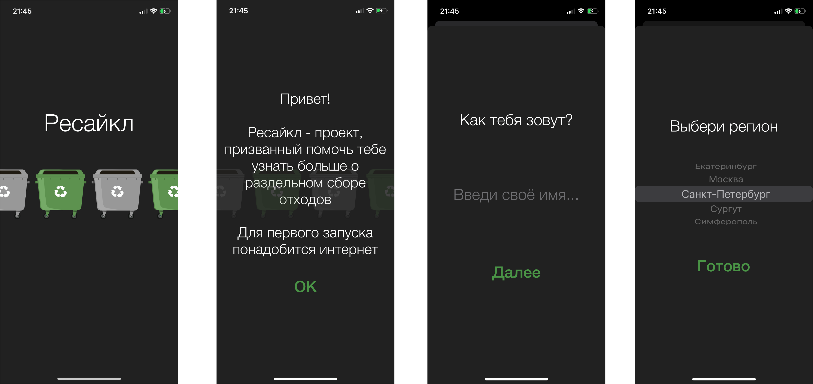
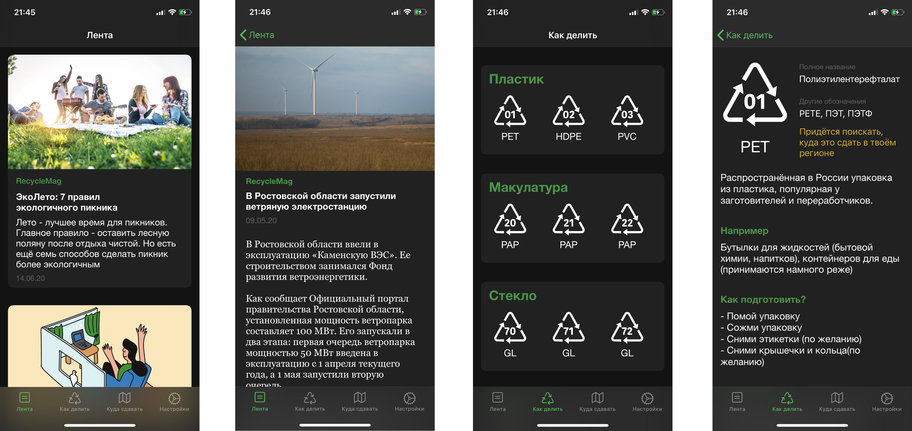
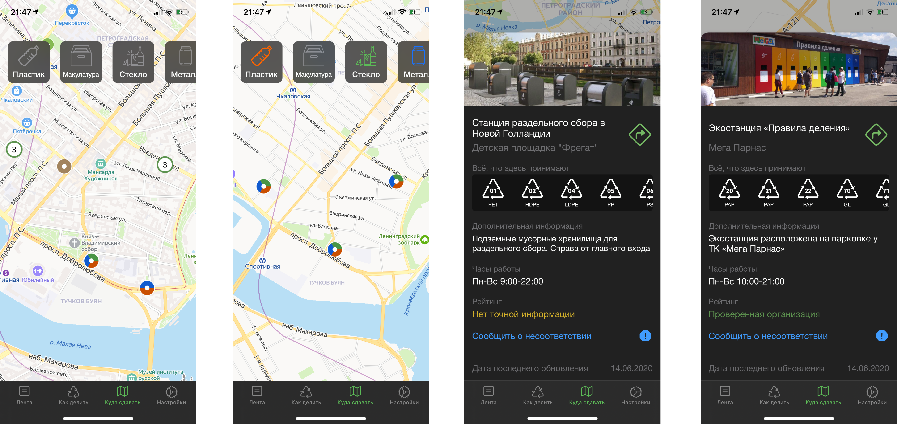
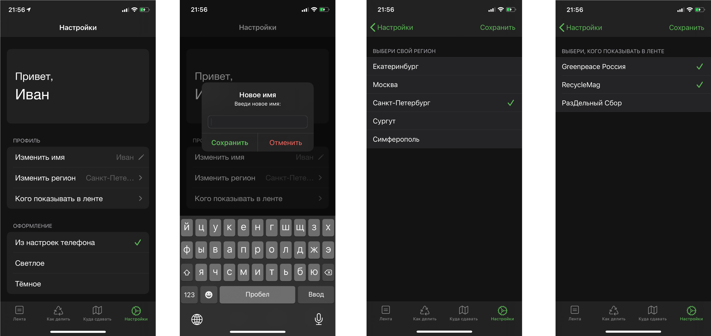
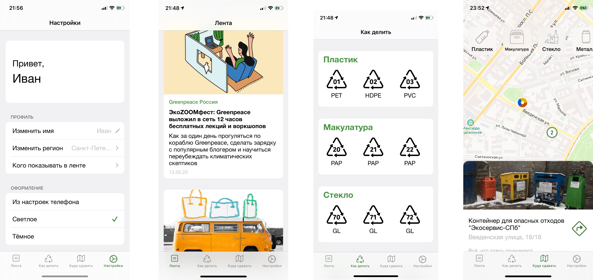

# RecycleProject

### General
iOS-application for green lifestyle, and for helping with waste sorting in particular. Allows the user to read newsfeed with eco-friendly articles, browse handbook about waste sorting,search for recycling points on the map and set some user's settings.

### Technology stack
Language - Swift 5. IDE - Xcode 11.5.  
Minimum supported iOS version - 13.4.  
Cloud storage (backend) - [Firebase](https://firebase.google.com). Cloud Firestore for main database, Storage for images.  
Local storage - Core Data for handbook, UserDefaults for user's settings.  
Map framework - [Yandex MapKit SDK 3.5](https://tech.yandex.ru/maps/mapkit/).  
Another frameworks - [Floating panel](https://github.com/SCENEE/FloatingPanel).  
Has been tested - on device (iPhone X) and simulators (iPhone SE,iPhone 11 Pro Max, iPad 12.9, iPad 9.7)

### Project structure
**Applcation architecture** - Model-View-Contoller (MVC).  
**Application based on:** TabBarController and has four screens: newsfeed, handbook, map and settings.  
**Application modules:** Newsfeed screen based on Table View and Navigation Controller with ViewController for fullscreen news item. Handbook based on Table View with Collection View in table cells also with fullscreen recycle information. Map with recycle points using MapView (from Yandex MapKit) and Collection View for filtering, and has modally presented view for describing of recycle point. Settings screen based on static Table View.  
**Work with storages:** Application send requests to Firebase to get some content (news, recycle points, etc.). Some of this information copy on local storage, some of this caching to working without internet connection. Information for handbook saves to CoreData from .plist files at the first application launch. User's settings include some data from server (like region, preferred news publishers) and local data (like name and preferred theme style).

____

### Application Demo
* First launch
  

* Newsfeed and Handbook
  

* Recycle points map
  

* Settings
  

* Light mode supporting

